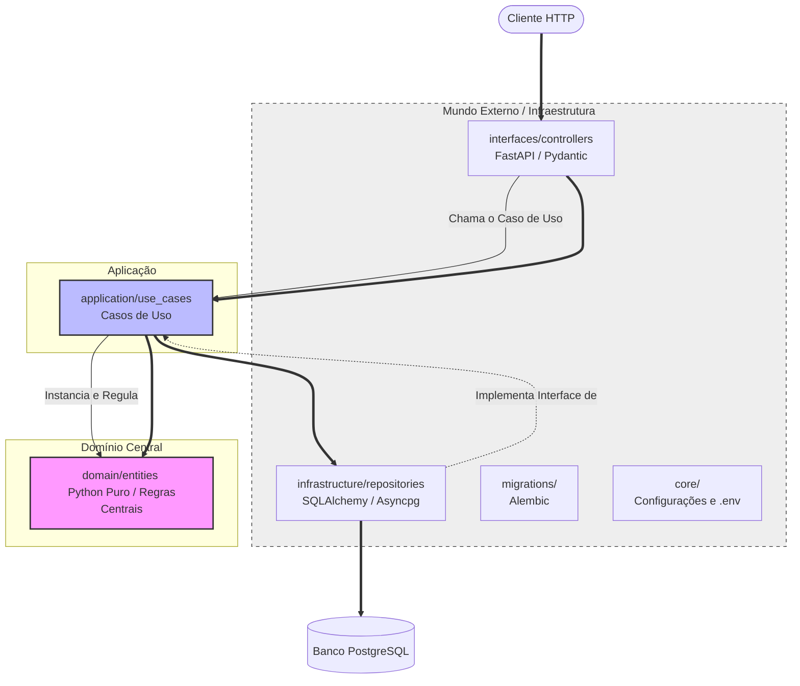

```mermaid
graph TD
    %% Estilos e Camadas
    subgraph Camada_Externa [Mundo Externo / Infraestrutura]
        HTTP[interfaces/controllers <br> FastAPI / Pydantic]
        DB_CON[infrastructure/repositories <br> SQLAlchemy / Asyncpg]
        MIG[migrations/ <br> Alembic]
        CORE[core/ <br> Configurações e .env]
    end

    subgraph Camada_Aplicacao [Aplicação]
        UC[application/use_cases <br> Casos de Uso]
    end

    subgraph Camada_Dominio [Domínio Central]
        DOM[domain/entities <br> Python Puro / Regras Centrais]
    end

    %% Fluxo de Dependência (Sempre para dentro)
    HTTP -->|Chama o Caso de Uso| UC
    DB_CON -.->|Implementa Interface de| UC
    UC -->|Instancia e Regula| DOM

    %% Fluxo de Execução Prático
    Requisicao([Cliente HTTP]) ===> HTTP
    HTTP ===> UC
    UC ===> DOM
    UC ===> DB_CON
    DB_CON ===> Postgres[(Banco PostgreSQL)]

    style DOM fill:#f9f,stroke:#333,stroke-width:2px
    style UC fill:#bbf,stroke:#333,stroke-width:2px
    style Camada_Externa fill:#eee,stroke:#333,stroke-dasharray: 5 5

```
